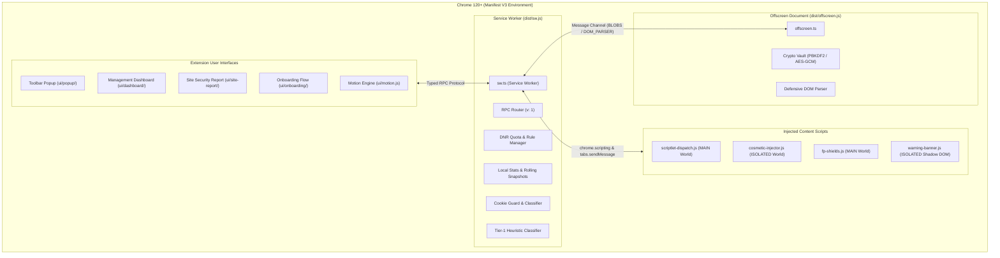

<p align="center">
  
</p>

<p align="center">
  <strong>Intelligent Privacy &amp; Web Protection for Google Chrome</strong><br>
  <em>Local-first, high-performance ad blocking, tracking prevention, and real-time threat defense built on Manifest V3.</em>
</p>

<p align="center">
  <a href="https://github.com/md-aktaruzzman-emon/AUVYQ-ad-blocker-Extension/actions"></a>
  <a href="https://developer.chrome.com/docs/extensions/mv3/intro/"></a>
  <a href="https://www.typescriptlang.org/"></a>
  <a href="#privacy--security"></a>
  <a href="#crypto-vault--backup"></a>
  <a href="https://vitest.dev/"></a>
</p>

---

## Overview

**AUVYQ** (**A**dvanced **U**ser **V**isibility & **Y**our Privacy **Q**uotient) is a modern, local-first browser protection extension engineered for Google Chrome (Manifest V3, Chrome 120+). 

Traditional ad blockers often rely on heavy background DOM engines, bloated remote lists, or invasive telemetry. AUVYQ takes a fundamentally different engineering approach:

* **100% Local-First Processing**: Every rule compilation, heuristic risk score, cookie evaluation, and telemetry queue operates strictly on your local machine.
* **Declarative Performance**: Utilizes Chrome's native `declarativeNetRequest` engine for wire-speed network blocking with zero per-request CPU overhead.
* **Zero Arbitrary Code Execution**: Enforces a strict Content Security Policy (`script-src 'self'`). Dynamic `eval()`, `new Function()`, and remote script downloads are structurally impossible.
* **Calm & Transparent UX**: Operates quietly without aggressive notifications or intrusive badges. Every metric is verifiable, and telemetry is completely disabled by default.

---

## Core Features

### 1. High-Performance Network Ad & Tracker Blocking
* **DeclarativeNetRequest Engine**: Evaluates network requests against compiled rulesets directly in the browser's networking stack, eliminating JavaScript execution overhead on every HTTP request.
* **Static & Dynamic Rulesets**: Combines optimized static rule packs (`main.json`, `ads-trackers.json`, `annoyances.json`) with dynamic user rule management.
* **Smart Dynamic Quota Management**: Enforces a strict safety ceiling of 28,000 dynamic rules (`SAFE_DYNAMIC_CAPACITY`), maintaining 2,000 rules of headroom below Chrome's 30,000 limit. Rules are utility-scored ($\text{frequency} \times \text{confidence}$); excess rules with visual selectors are automatically demoted to cosmetic CSS blocks to prevent visual ad regressions.
* **Priority Stratification**: User-defined and per-site allow rules receive a +100 priority boost, guaranteeing instant, reliable site unbreaking without restarting the background service worker.

### 2. Cosmetic Filtering & Visual Clean-up
* **Early DOM Injection**: Synchronously injects curated cosmetic stylesheet rules into an isolated content script world at `document_start` and `document_idle`.
* **Zero Layout Jumps**: Targets ad wrappers, sponsored units, empty placeholder containers, and video promotional frames before initial layout paint.
* **Scoped Per-Domain Overlays**: Applies site-specific visual hiding rules while ensuring high site compatibility.

### 3. Sandboxed Scriptlet Defenses (15 Fixed Scriptlets)
AUVYQ bundles a closed, audited library of **15 pre-compiled scriptlets** executed in the page's `MAIN` world to neutralize advanced anti-adblock scripts and tracking hooks without dynamic code generation:

| Scriptlet | Purpose & Defense Mechanism |
| :--- | :--- |
| `noop-callback` | Replaces tracking callback properties with safe no-op functions. |
| `json-prune-lite` | Prunes injected ad/tracking payloads from API JSON responses. |
| `set-constant` | Stubs tracking configuration flags with frozen, constant values. |
| `prevent-addEventListener` | Blocks intrusive event listeners (e.g., `visibilitychange`, `blur` monitoring). |
| `prevent-setTimeout` | Neutralizes recurring timer loops used by aggressive ad injectors. |
| `noop-fetch` | Defuses analytical beacon endpoints called via `window.fetch`. |
| `no-fetch-if` | Conditionally cancels fetch calls matching targeted ad/tracking substrings. |
| `no-xhr-if` | Intercepts and drops tracking `XMLHttpRequest` payloads. |
| `abort-on-property-read` | Throws reference errors upon read access to adblock detection probes. |
| `close-window` | Automatically suppresses unauthorized popup and popunder window spawns. |
| `hide-in-shadow` | Pierces closed Shadow DOM boundaries to hide encapsulated ad nodes. |
| `remove-class` | Strips anti-adblock overlay CSS classes from document body elements. |
| `remove-attr` | Removes adblock-probing attributes from page elements. |
| `prevent-eval-if` | Wraps page-level `eval` to neutralize anti-adblock evaluation routines. |
| `trusted-suppress-console` | Silences repetitive ad-network error spam in the developer console. |

> **Prototype Pollution Defense**: All scriptlet parameters are strictly validated against prototype pollution vectors (`__proto__`, `constructor`, `prototype`), forbidden global roots (`window`, `document`, `location`), and character control limits before dispatch.

### 4. Third-Party Tracker Cookie Guard
* **Granular Cookie Classification**: Inspects and categorizes cookie domains into `tracker`, `analytics`, `session`, and `essential` based on a local domain classification dataset.
* **Automated Contextual Cleanup**: Cleans third-party tracking cookies upon tab closure (`chrome.tabs.onRemoved`) and during periodic background sweeps.
* **Session Integrity Guarantee**: Authentication cookies, first-party login tokens, and shopping carts are strictly preserved and never purged.

### 5. Tracking Parameter Stripping
* **Clean URLs**: Strips pervasive surveillance and campaign query parameters (e.g., `utm_*`, `fbclid`, `gclid`, `mc_eid`, `yclid`, `igshid`) before network requests leave the browser.
* **DNR Redirect Transforms**: Uses native browser redirection rules without intermediary proxying or request logging.

### 6. Tier-1 Threat & Scam Heuristic Shield
* **Client-Side Risk Assessment**: Evaluates visited domains upon navigation commit (`webNavigation.onCommitted`) in $< 0.5\text{ ms}$ using local heuristics:
  * **Shannon Entropy Analysis**: Detects algorithmically generated domain names (DGA) and credential-harvesting endpoints.
  * **Punycode / Homograph Attack Detection**: Identifies IDN spoofing patterns (e.g., `xn--...`).
  * **Brand Typosquatting Analysis**: Evaluates Damerau-Levenshtein distance against ~200 high-value financial, social, and infrastructure domains.
* **Isolated Threat Warning Banner**: Injects an alert inside a closed Shadow Root (`z-index: 2147483647`) with a **3-tier danger escalation model**:
  1. *First Attempt*: CSS banner shake + plain-language explanation.
  2. *Second Attempt*: Explicit confirmation dialog.
  3. *Malicious Severity*: Mandatory typed confirmation (`"CONTINUE"` in capital letters) to prevent accidental click-throughs.

### 7. Encrypted Cryptographic Settings Vault
* **OWASP-Compliant Key Derivation**: PBKDF2 with SHA-256 and **600,000 iterations**.
* **Authenticated Cipher**: AES-GCM-256 with 128-bit authentication tags, 16-byte random salt, and 12-byte initialization vectors per backup.
* **Offscreen Document Isolation**: Heavy key derivation runs inside an isolated offscreen document (`offscreen.html`), preventing UI freezes or service worker stalling. The offscreen document automatically terminates after 60 seconds of inactivity.
* **Zero Plaintext Leakage**: Master passwords are never stored in memory, storage, or logs.

---

## Why AUVYQ?

| Dimension | Standard Ad Blockers | AUVYQ |
| :--- | :--- | :--- |
| **Runtime Architecture** | Manifest V2 legacy or heavy MV3 adapters | Native Manifest V3 with synchronous top-level lifecycle |
| **Security Surface** | May use dynamic `eval` or remote scriptlets | Strict CSP (`script-src 'self'`), 0% dynamic code execution |
| **Privacy Default** | Often collects opt-out analytics | 100% Local-First; Telemetry disabled by default |
| **Crypto Backups** | Plain JSON or base64 exports | PBKDF2 (600,000 iter) + AES-GCM-256 binary vault |
| **Heuristic Protection** | Cloud lookup queries | Local Shannon entropy & typosquatting analysis |
| **Resource Efficiency** | Constant background memory overhead | Auto-terminating offscreen documents & declarative rules |

---

## Architecture



---

## Project Structure

```text
AUVYQ/
├── assets/                  # Brand vectors (SVG), icons (16/32/48/128px), and banner
├── content/                 # Injected content scripts (cosmetics, scriptlets, banner)
├── core/                    # Core functional modules (local-first engine)
│   ├── cosmetic-engine/     # Dynamic CSS stylesheet packing and generator
│   ├── crypto/              # PBKDF2-SHA256 (600k) + AES-GCM-256 binary vault
│   ├── domain/              # Hostname canonicalization and suffix matching
│   ├── heuristic/           # Local entropy, homoglyph, and typosquatting scoring
│   ├── logging/             # Privacy-preserving, host-only logging system
│   ├── ml/                  # Lightweight client-side heuristic classification
│   ├── quota-manager/       # Dynamic DNR rule capacity (28k ceiling) and demotion
│   ├── rule-compiler/       # FilterIR to DNR JSON and RE2 regex validation
│   ├── rule-parser/         # Adblock filter syntax parser
│   ├── scriptlet-engine/    # 15 pre-compiled, prototype-pollution safe scriptlets
│   ├── stats/               # Daily aggregation counters and privacy scoring
│   ├── storage/             # Schema migration, IndexedDB, and settings management
│   ├── telemetry/           # Local-only coarse telemetry queue with k-anonymity
│   └── update-channel/      # Cryptographically signed ECDSA rule update verification
├── data/                    # Domain classifications, tracking params, and top domains
├── fixtures/                # Test pages, mock threats, and filter fixtures
├── platform-chrome/         # Chrome extension API adapters (DNR, cookies, RPC)
├── resources/               # Web-accessible resources (1x1 transparent gif, noop.js)
├── rules/                   # Compiled static DNR rulesets (main, ads, trackers, annoyances)
├── tests/                   # 11 Vitest test suites (70 automated unit & security tests)
├── tools/                   # Manifest, resource, icon, and packaging validators
├── types/                   # TypeScript interfaces, schemas, and Chrome API types
├── ui/                      # Responsive HTML/CSS/JS surfaces with motion system
│   ├── dashboard/           # Full settings, statistics, and rule management page
│   ├── onboarding/          # 3-step first-run privacy preset selection
│   ├── popup/               # Fast toolbar popup (<300ms target load time)
│   └── site-report/         # In-depth per-domain security and tracker analysis
├── _locales/                # Internationalization strings (English default)
├── manifest.json            # Authoritative Chrome Manifest V3 configuration
├── esbuild.mjs              # Deterministic ESM bundler and asset compiler
├── package.json             # Project dependencies, scripts, and engine constraints
└── tsconfig.json            # Strict TypeScript configuration
```

---

## Technology Stack

* **Runtime Target**: Google Chrome 120+ (Manifest V3)
* **Language**: TypeScript 5.6 (Strict Mode, Zero `any` policy) & ECMAScript Modules (ESM)
* **Build System**: [esbuild](https://esbuild.github.io/) 0.24 (Sub-millisecond bundling to `dist/sw.js` and `dist/offscreen.js`)
* **Testing Framework**: [Vitest](https://vitest.dev/) 2.1 (Unit, integration, and security hygiene tests)
* **Linter & Hygiene**: ESLint 9 (Flat config, custom Manifest V3 security rules)
* **Cryptography**: Native Web Crypto API (`SubtleCrypto` — PBKDF2, AES-GCM, SHA-256, ECDSA P-256)
* **Browser APIs**: `chrome.declarativeNetRequest`, `chrome.scripting`, `chrome.offscreen`, `chrome.storage`, `chrome.cookies`, `chrome.alarms`, `chrome.webNavigation`

---

## Installation & Setup

### Prerequisites
* [Node.js](https://nodejs.org/) version 20.0.0 or higher
* [npm](https://www.npmjs.com/) version 10.0.0 or higher
* Google Chrome (or Chromium-based browser) version 120+

### 1. Clone the Repository
```bash
git clone https://github.com/md-aktaruzzman-emon/AUVYQ-ad-blocker-Extension.git
cd AUVYQ-ad-blocker-Extension
```

### 2. Install Dependencies
```bash
npm install
```

### 3. Build Extension Bundle
```bash
npm run build
```
The compiled, production-ready extension will be output to the `dist/` directory.

### 4. Load in Google Chrome
1. Open Google Chrome and navigate to `chrome://extensions`.
2. Enable the **Developer mode** toggle in the top right corner.
3. Click the **Load unpacked** button.
4. Select the `dist/` directory inside the project repository.
5. The **AUVYQ** shield icon will appear in your browser toolbar.

---

## Development & Verification

The project includes a comprehensive test and validation pipeline:

```bash
# Run strict TypeScript typechecking
npm run typecheck

# Lint all source files for security and style
npm run lint

# Execute automated Vitest test suite (11 suites, 70 tests)
npm test

# Run the complete release verification pipeline
npm run check
```

---

## Browser Permissions & Transparency

As a privacy and security product, AUVYQ maintains complete transparency regarding all requested permissions:

| Permission | Technical Requirement & Justification |
| :--- | :--- |
| `declarativeNetRequest` | Wire-speed network blocking of ads, tracking beacons, and malicious endpoints without intercepting request bodies. |
| `declarativeNetRequestFeedback` | Provides accurate blocking counters in developer/unpacked mode for statistical validation. |
| `storage` | Stores user configuration, per-site pause lists, and daily aggregate statistics locally on disk. |
| `unlimitedStorage` | Prevents the browser from prematurely evicting compiled rule caches and historical snapshots. |
| `scripting` | Dynamically registers isolated cosmetic stylesheets and scriptlet dispatchers into web pages. |
| `alarms` | Schedules background maintenance (periodic cookie cleanup, stats flushing, and offscreen document teardown). |
| `offscreen` | Spawns an isolated background document to execute intensive PBKDF2 cryptography without freezing the UI. |
| `webNavigation` | Hooks into navigation commit events to evaluate client-side heuristic scam and phishing indicators. |
| `cookies` | Reads cookie metadata to categorize and delete third-party tracking cookies upon tab closure. |
| `tabs` | Resolves active tab hostnames to render per-site protection states and toggle pause controls. |
| `<all_urls>` (Host) | Universal protection coverage across web pages visited by the user. |

---

## Privacy & Security Guarantees

* **Zero Browsing History Collection**: AUVYQ never records, logs, or transmits full URLs, paths, search queries, form inputs, or credentials.
* **Host-Only Logging**: Internal logging is restricted to normalized hostnames (e.g., `example.com`), completely stripping URL query parameters and paths.
* **Telemetry Off by Default**: Telemetry is strictly opt-in during onboarding. When enabled, telemetry collects only coarse daily category counters (`blocks`, `params`, `threats`) and requires a local k-anonymity cohort gate ($k \ge 50$) before transmission seams can activate.
* **Zero Remote JavaScript**: All executable code is bundled at build time. No remote JavaScript is ever fetched or evaluated at runtime.

---

## Roadmap

### Completed (v0.3.0)
- [x] Manifest V3 full migration with synchronous service worker lifecycle.
- [x] DeclarativeNetRequest static rulesets & dynamic quota management (28,000 rule safety ceiling).
- [x] Sandboxed 15-scriptlet engine with strict prototype-pollution defenses.
- [x] Early cosmetic CSS stylesheet injection.
- [x] Domain-classified third-party cookie guard with tab-close cleanup.
- [x] Client-side Tier-1 heuristic threat detection (entropy, typosquatting, homographs).
- [x] PBKDF2-SHA256 (600k iter) + AES-GCM-256 cryptographic settings vault.
- [x] Complete motion system with 7 micro-interactions and `@media (prefers-reduced-motion)` compliance.
- [x] Automated test suite with 11 suites and 70 passing tests.

### In Progress
- [ ] Multi-language localization expansion beyond English (`_locales/`).
- [ ] Enhanced user-customizable filter list import with syntax linting.
- [ ] Advanced fingerprint shielding telemetry diagnostics.

### Planned
- [ ] Firefox MV3 WebExtensions compatibility target.
- [ ] WebAssembly-accelerated RE2 matching for custom filter lists.
- [ ] Encrypted cross-device settings sync via user-controlled WebDAV/Cloud storage.

---

## Contributing

Contributions to AUVYQ are welcome. To ensure safety and code quality:

1. Fork the repository and create your branch from `main`:
   ```bash
   git checkout -b feature/your-feature-name
   ```
2. Ensure all changes adhere to strict TypeScript standards (zero `any`) and ESLint rules.
3. Add unit tests in `tests/` covering any new functionality.
4. Run the full verification suite before submitting your PR:
   ```bash
   npm run check
   ```
5. Open a Pull Request with a clear description of your changes and test coverage.

---

## Author & Developer

**Md. Aktaruzzman Emon**  
* GitHub: [@md-aktaruzzman-emon](https://github.com/md-aktaruzzman-emon)  
* Repository: [AUVYQ-ad-blocker-Extension](https://github.com/md-aktaruzzman-emon/AUVYQ-ad-blocker-Extension)

---

## License

Licensing information for bundled filter datasets and source code is documented in the [`licenses/`](licenses/) directory. Third-party filter lists retain their respective original licenses. Complete project licensing terms will be updated in upcoming releases.
