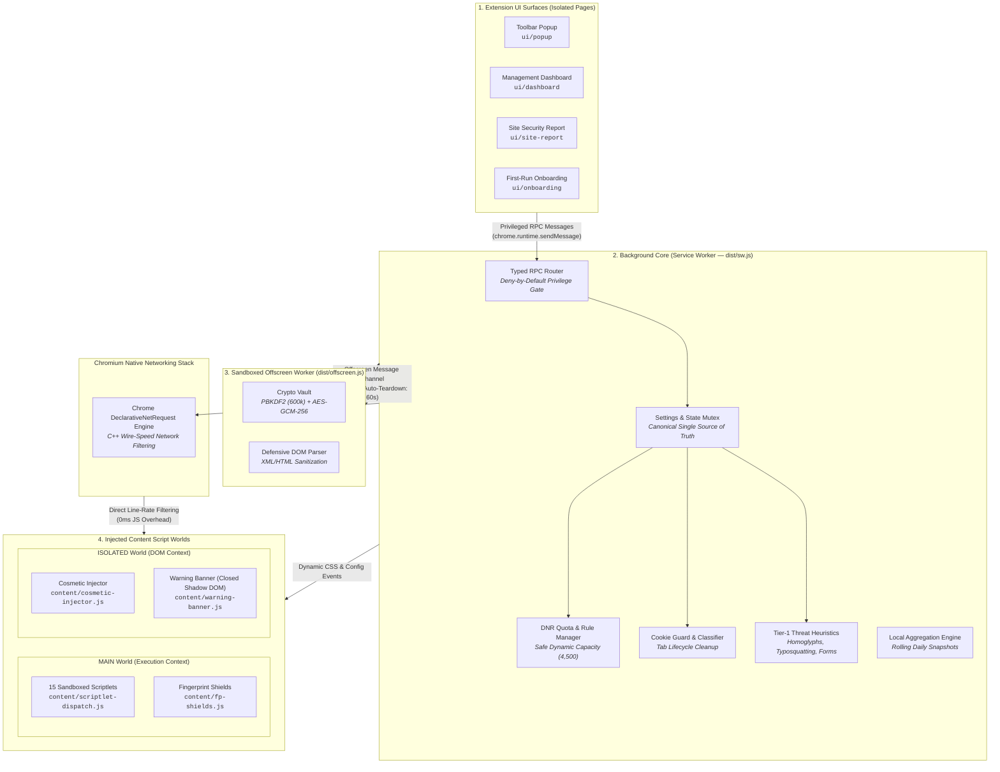

<p align="center">
  
</p>

<div align="center">

# AUVYQ

### The Local-First Privacy Shield & Autonomous Web Security Engine for Chrome

**Browse 2–4× faster, block intrusive ads and trackers, defuse deceptive phishing scams, and reclaim your digital privacy — without sending a single byte of your data to the cloud.**

<p align="center">
  <a href="https://developer.chrome.com/docs/extensions/mv3/intro/"></a>
  <a href="https://www.typescriptlang.org/"></a>
  <a href="https://vitest.dev/"></a>
  <a href="#privacy-by-design"></a>
  <a href="#6-cryptographic-settings-vault"></a>
  <a href="#license"></a>
</p>

<p align="center">
  <a href="#-why-auvyq">Why AUVYQ?</a> •
  <a href="#-quick-start-install-in-60-seconds">Install in 60s</a> •
  <a href="#-what-auvyq-does-for-you">Features</a> •
  <a href="#-protection-presets">Presets</a> •
  <a href="#-system-architecture">Architecture</a> •
  <a href="#-security--privacy-guarantees">Security & Privacy</a> •
  <a href="#-faq">FAQ</a>
</p>

</div>

---

## ⚡ The Modern Web is Broken. AUVYQ Fixes It.

Every time you open a webpage today:
- **Trackers follow you**: Advertisers and data brokers log your clicks, location, device fingerprints, and browsing history.
- **Pages load agonizingly slow**: More than 60% of network requests on major media websites are ad scripts, telemetry beacons, and auction bids that drain your battery and waste your mobile data.
- **Popups break your focus**: Cookie consent banners, fullscreen newsletter overlays, and push-notification prompts interrupt your reading.
- **Cybercriminals exploit lookalikes**: Deceptive homograph domains (Unicode lookalikes) and fake login forms steal credentials before users realize they've left the real site.

Most legacy extensions try to fix this by running heavy JavaScript in the background, consuming hundreds of megabytes of RAM, or sending your browsing history to remote "threat intelligence" servers.

**AUVYQ was built from scratch to take a fundamentally better approach:**

| Feature | Legacy Ad Blockers | AUVYQ |
| :--- | :---: | :---: |
| **Engine Core** | Slow background JavaScript DOM parsers | **Native Chromium C++ DeclarativeNetRequest** (wire-speed, 0ms JS lag) |
| **Telemetry & Cloud Pings** | Frequently sends telemetry & URL lookups | **100% Local-First** — Zero cloud lookups, zero tracking pings |
| **Phishing & Scam Defense** | None (only blocks known ad domains) | **Client-side Heuristics** (Homoglyphs, Typosquatting, Foreign Forms) |
| **Cookie Management** | Basic third-party blocking | **Smart Cookie Guardian** (cleans trackers on tab close, preserves logins) |
| **Tracking URLs** | Leaves URLs unchanged | **Automatic Parameter Sanitization** (`utm_*`, `fbclid`, `gclid`, etc.) |
| **Settings Security** | Plaintext JSON in local storage | **PBKDF2 (600k iterations) + AES-256-GCM Encrypted Vault** |
| **Platform Standard** | Legacy Manifest V2 or compromised MV3 | **Pure Native Manifest V3** (Chrome 120+ standard) |
| **Design & UI** | Cluttered, outdated dialogs | **Modern Dashboard** with Light & Dark theme parity |

---

## 🚀 Quick Start (Install in 60 Seconds)

You don't need to be a developer to run AUVYQ. Follow these 4 quick steps to install it on **Google Chrome**, **Brave**, **Microsoft Edge**, or any Chromium-based browser:

```markdown
1. Download or clone this repository:
   git clone https://github.com/md-aktaruzzman-emon/AUVYQ-ad-blocker-Extension.git

2. Open your browser and navigate to:
   chrome://extensions  (or edge://extensions / brave://extensions)

3. Turn ON "Developer mode" toggle in the top-right corner.

4. Click "Load unpacked" and select the extension directory.
```

🎉 **That's it!** The AUVYQ shield icon will appear in your browser toolbar. All core protections (ad blocking, tracker prevention, cookie isolation, and threat heuristics) are immediately active out of the box with zero setup needed.

---

## ✨ What AUVYQ Does For You

### 1. Wire-Speed Ad & Video Blocking
AUVYQ stops ads **before they even download**. Utilizing Chromium's native `declarativeNetRequest` (DNR) C++ engine, filtering happens directly inside the browser's network layer.
- **Zero Video Ad Interruptions**: Suppresses pre-roll, mid-roll, and companion banners.
- **Pre-Paint Cosmetic Filtering**: Curated stylesheet rules hide banner placeholders, empty frames, and sponsored modules before the browser draws the page — eliminating visual layout shifts.
- **Anti-Adblock Defusal**: Bundles a library of **15 sandboxed scriptlets** running in safe page contexts to neutralize adblock-detection traps without injecting arbitrary dynamic code.

### 2. Autonomous Scam, Phishing & Typosquatting Defense
AUVYQ actively inspects navigated domains and page forms on-device upon navigation commit:
- **Homoglyph & Punycode Detection**: Flags deceptive Unicode domain names (e.g. Cyrillic `а` replacing Latin `a`) used to imitate major banking and auth services.
- **Typosquatting Engine**: Evaluates Damerau-Levenshtein edit distances against high-profile services to detect fake lookalike domains.
- **Foreign Credential Harvest Guard**: Detects login forms embedded on websites whose `action` attribute transmits your password to an unrelated third-party origin.
- **Protected Shadow DOM Warning**: Injects an isolated, tamper-proof warning banner with typed confirmation safeguards on verified high-risk destinations.

### 3. Smart Cookie Guardian (Never Lose Your Logins)
- **Automatic Background Cleanup**: Identifies third-party advertising and analytics cookies and purges them when you close a tab (`chrome.tabs.onRemoved`).
- **Session Preservation Guarantee**: Essential authentication cookies, session tokens, and active shopping carts are strictly safeguarded and never removed.
- **Zero Cookie Popups**: Neutralizes GDPR/CCPA cookie consent banners and intrusive "Accept All" overlays so you can read without interruptions.

### 4. URL Tracking Parameter Stripping
Ever noticed long links containing `?utm_source=...`, `?fbclid=...`, or `?gclid=...`? Those parameters link your browsing across different platforms.
- AUVYQ strips surveillance parameters on-the-fly using native DNR redirect transformations before the network request leaves your machine.
- Supported parameters include: `utm_*`, `fbclid`, `gclid`, `msclkid`, `mc_eid`, `mc_cid`, `yclid`, `ttclid`, `li_fat_id`, `epik`, `_openstat`, `srsltid`, `gbraid`, `wbraid`.

### 5. Optional Fingerprint Shields (For Paranoid Privacy)
For users requiring defense against advanced cross-site browser fingerprinting:
- **Canvas Readback Noise**: Injects subtle, imperceptible mathematical noise into `getImageData` and `toDataURL`.
- **WebGL Masking**: Normalizes graphics card identifiers (`UNMASKED_RENDERER_WEBGL`).
- **Timing Jitter**: Defuses microsecond cache-timing attacks by rounding `performance.now()`.

### 6. Cryptographic Settings Vault
Export and import your custom whitelist, configurations, and filter rules with military-grade encryption:
- **PBKDF2-SHA256**: 600,000 key derivation iterations.
- **AES-256-GCM**: Authenticated symmetric encryption with 128-bit authentication tags, random 16-byte salts, and 12-byte initialization vectors.
- Executed inside an isolated offscreen document to ensure UI responsiveness.

---

## 🎛️ Protection Presets

AUVYQ provides five pre-configured protection profiles to match your personal preference:

```
  [ Basic ] ───► [ Balanced ] ───► [ Strong ] ───► [ Maximum ] ───► [ Expert ]
(Max Compatibility)  (Recommended)     (Stricter)     (Full Shields)    (Custom)
```

| Preset | Target Experience | Ads | Trackers | Cookie Popups | Cookie Cleanup | Threat Heuristics | Fingerprint Shields |
| :--- | :--- | :---: | :---: | :---: | :---: | :---: | :---: |
| **Basic** | Maximum compatibility; essential ad blocking with zero chance of site breakage. | ✅ | ❌ | ❌ | ❌ | ❌ | ❌ |
| **Balanced** *(Default)* | **Recommended for everyone**; blocks ads, tracking beacons, dangerous lookalikes, and cleans tracker cookies. | ✅ | ✅ | ❌ | ✅ | ✅ | ❌ |
| **Strong** | Stricter protection; enables annoyance blocking, stricter threat sensitivity, and aggressive cookie sweeps. | ✅ | ✅ | ✅ | ✅ | ✅ | ❌ |
| **Maximum** | Maximum privacy; enables all fingerprinting noise shields and highest heuristic sensitivity. | ✅ | ✅ | ✅ | ✅ | ✅ | ✅ |
| **Expert** | Complete manual control; customize individual modules, custom rules, and sensitivity sliders. | Custom | Custom | Custom | Custom | Custom | Custom |

---

## 🖥️ Modern User Interface Tour

AUVYQ features a modern interface built with fluid responsive design, accessible contrast, and full **Light Mode** & **Dark Mode** parity:

### 1. Toolbar Popup (`ui/popup`)
- **One-Click Master Toggle**: Pause or resume protection instantly for the active site or globally.
- **Live Counter Badges**: See exactly how many ads, trackers, and query parameters were neutralized on the current tab.
- **Direct Site Report**: Open the live tab security inspector with a single click.

### 2. Comprehensive Control Dashboard (`ui/dashboard`)
- **Overview**: Real-time protection score, cumulative block counters, and a 7-day interactive activity graph.
- **Protection**: 5-column preset selector with instant module toggles and dynamic rule stats.
- **Cookies**: Visual classification chips (Essential vs Tracker), searchable cookie table, and manual sweep trigger.
- **Threat Intelligence**: Live defense status bar, threat scope matrix (Credential Harvesting, Homographs, Open Redirects), and real-time security log.
- **Reports & Diagnostics**: Filter update check, site report launcher, and offline rule engine status.
- **Settings**: Encrypted backup vault export/import, theme selector (Midnight Dark / Crisp Light / System), and terminal diagnostics.
- **About**: Runtime architecture specs, active rule counts (159 DNR rules, 130 cosmetic selectors), and open-source acknowledgements.

---

## 🏗️ System Architecture

AUVYQ is engineered around Chromium's Manifest V3 process isolation model, separating tasks across four distinct execution contexts:



### Scriptlet Security Library (15 Pre-Compiled Defenses)
AUVYQ never generates code at runtime. All scriptlets are pre-compiled and verified against prototype pollution attacks:

| Scriptlet | Defense Function |
| :--- | :--- |
| `noop-callback` | Stubs intrusive tracking callbacks with harmless no-op functions. |
| `json-prune-lite` | Prunes injected ad and telemetry payloads from JSON API responses. |
| `set-constant` | Freezes tracking configuration variables to harmless static dummy values. |
| `prevent-addEventListener` | Blocks intrusive event hooks (e.g., tab blur or visibility surveillance). |
| `prevent-setTimeout` | Defuses recursive timer loops used by aggressive ad re-injectors. |
| `noop-fetch` | Defuses analytical beacon endpoints invoked via `window.fetch`. |
| `no-fetch-if` | Conditionally cancels fetch calls matching targeted tracking URL signatures. |
| `no-xhr-if` | Intercepts and drops tracking `XMLHttpRequest` payloads. |
| `abort-on-property-read` | Neutralizes anti-adblock probe properties by throwing handled reference errors. |
| `close-window` | Suppresses unauthorized popup and popunder window spawns. |
| `hide-in-shadow` | Traverses Shadow DOM trees to hide encapsulated advertisement nodes. |
| `remove-class` | Strips anti-adblock overlay CSS classes from document body elements. |
| `remove-attr` | Removes adblock-probing attributes from page elements. |
| `prevent-eval-if` | Wraps page-level `eval` calls to prevent anti-adblock execution. |
| `trusted-suppress-console` | Silences repetitive ad-network error spam in the developer console. |

---

## 🔒 Security & Privacy Guarantees

### Privacy by Design
- **100% On-Device Processing**: All DeclarativeNetRequest matching, cookie classification, and heuristic threat calculations happen on your computer.
- **Zero Cloud Telemetry**: Telemetry is completely disabled by default. If manually opted-in, only coarse local daily counts are buffered and protected with a $k$-anonymity gate ($k \ge 50$).
- **No Browsing History Stored**: Visited URLs, search queries, passwords, and form inputs are never logged, stored, or transmitted.

### Security by Design
- **Strict Content Security Policy**: `script-src 'self'; object-src 'self'`.
- **Deny-by-Default RPC**: Content scripts cannot read settings, storage, or threat logs. All privileged actions (`SET_SETTINGS`, `CLEAR_AUVYQ_DATA`, `EXPORT_BACKUP`) are strictly restricted to verified internal extension pages.
- **Zero Dynamic Code Execution**: Prohibits `eval()`, `new Function()`, and remote script injection.
- **Cryptographically Signed Rule Updates**: Remote filter updates are validated against ECDSA P-256 signatures with SHA-256 hashes before activation.

---

## 💻 Developer & Contributor Guide

### Prerequisites
- [Node.js](https://nodejs.org/) version 20.0.0 or higher
- [npm](https://www.npmjs.com/) version 10.0.0 or higher
- Chromium-based browser (Chrome, Brave, Edge) version 120+

### Development Workflow

```bash
# 1. Clone the repository
git clone https://github.com/md-aktaruzzman-emon/AUVYQ-ad-blocker-Extension.git
cd AUVYQ-ad-blocker-Extension

# 2. Install dependencies
npm install

# 3. Build the extension (compiles TypeScript & filters to dist/)
npm run build

# 4. Watch mode for live development
npm run dev

# 5. Run strict TypeScript check
npm run typecheck

# 6. Run ESLint
npm run lint

# 7. Run Vitest test suite (18 test suites, 118 tests)
npm test

# 8. Full CI validation pipeline
npm run check
```

---

## ❓ Frequently Asked Questions (FAQ)

<details>
<summary><strong>Will AUVYQ slow down my browser?</strong></summary>
<p>
<strong>No — quite the opposite!</strong> Because AUVYQ uses Chrome's native <code>declarativeNetRequest</code> API, network requests are filtered directly in Chromium's C++ core before any JavaScript executes. By preventing megabytes of ad scripts, tracking beacons, and video bloat from downloading, AUVYQ typically speeds up page load times by 2× to 4× and reduces laptop battery drain.
</p>
</details>

<details>
<summary><strong>Will AUVYQ break my logins or shopping carts?</strong></summary>
<p>
<strong>Never.</strong> AUVYQ's Cookie Guardian classifies cookies into categories (Essential, Session, Analytics, Tracker). Only third-party tracking cookies are cleaned up on tab close. Your authentication tokens, login cookies, and e-commerce shopping carts are strictly protected.
</p>
</details>

<details>
<summary><strong>How is AUVYQ different from uBlock Origin or AdGuard?</strong></summary>
<p>
While traditional ad blockers focus primarily on ad filtering, AUVYQ is an integrated <strong>Privacy & Browser Security Engine</strong> built from day one for <strong>Manifest V3</strong>. In addition to wire-speed ad and tracker blocking, AUVYQ includes client-side heuristic phishing detection, typosquatting defense, cross-origin credential harvesting warnings, automatic tracking parameter stripping, and an encrypted PBKDF2/AES-GCM configuration vault.
</p>
</details>

<details>
<summary><strong>How do I pause protection for a specific website?</strong></summary>
<p>
Simply click the AUVYQ shield icon in your browser toolbar to open the popup, and toggle the switch for the current site. AUVYQ applies a +100 priority allowlist rule instantly without needing to restart your browser or service worker.
</p>
</details>

<details>
<summary><strong>Does AUVYQ send any data back to developers?</strong></summary>
<p>
<strong>No.</strong> AUVYQ operates under a strict <strong>100% Local-First</strong> architecture. There are no remote tracking servers, no telemetry pings, and no analytics databases. All processing stays on your device.
</p>
</details>

---

## 🛡️ Permissions & Technical Justifications

| Permission | Justification |
| :--- | :--- |
| `declarativeNetRequest` | Wire-speed network blocking of ads and trackers without inspecting packet bodies. |
| `declarativeNetRequestFeedback` | Provides accurate blocked-request counters in developer/unpacked mode for user metrics. |
| `storage` & `unlimitedStorage` | Stores user settings, allowlists, and daily aggregated statistics safely on disk. |
| `scripting` | Dynamically injects cosmetic CSS hiding rules and sandboxed scriptlets into visited pages. |
| `alarms` | Schedules background maintenance (periodic cookie cleanup and memory teardown). |
| `offscreen` | Spawns an isolated document to run heavy PBKDF2 cryptography without freezing the UI. |
| `webNavigation` | Hooks navigation commit events to evaluate client-side phishing and homograph heuristics. |
| `cookies` | Reads cookie metadata to categorize and delete third-party trackers when tabs close. |
| `tabs` | Resolves active tab hostnames to display per-site protection status in the toolbar popup. |
| `<all_urls>` | Universal protection coverage across web pages visited by the user. |

---

## 👥 Upstream Acknowledgements

AUVYQ is built with deep gratitude for the global open-source web privacy research community:
- **EasyList & EasyPrivacy** — Standard ad and tracking filter community definitions.
- **uBlock Origin Community** — Pioneers of declarative rule syntax and scriptlet engineering patterns.
- **Peter Lowe's Blocklist** — Ad server and tracking host lists.
- **W3C PrivacyCG & Chromium DNR Working Group** — Modern browser privacy specifications.

---

## 👤 Author

**Md. Aktaruzzman Emon**  
- **GitHub**: [@md-aktaruzzman-emon](https://github.com/md-aktaruzzman-emon)  
- **Repository**: [AUVYQ-ad-blocker-Extension](https://github.com/md-aktaruzzman-emon/AUVYQ-ad-blocker-Extension)

---

## 📄 License

This project is open-source and released under the **[MIT License](LICENSE)**.
Third-party filter lists and community rules retain their respective licenses as documented in the [`licenses/`](licenses/) directory.

<div align="center">
  <sub>Built with precision for Chromium • Fast, Private & Autonomous • 100% Local-First</sub>
</div>
