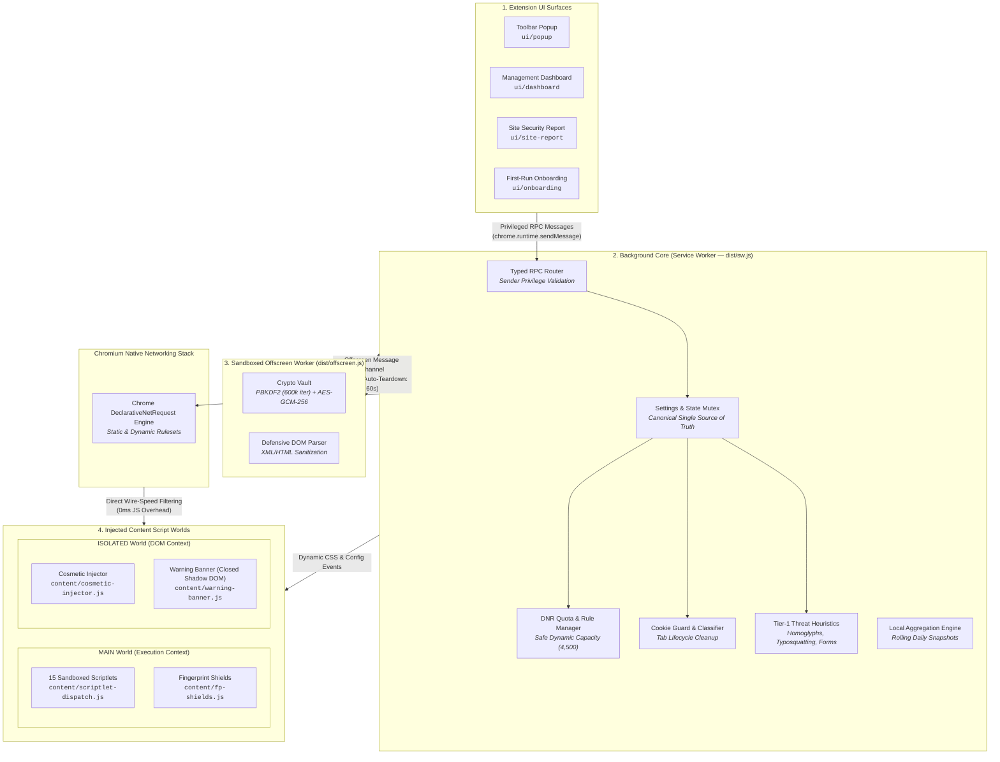

<p align="center">
  
</p>

<div align="center">

# AUVYQ

### Local-First Privacy, Ad Blocking, Tracker Defense & Threat Protection for Chrome

*A high-performance, security-focused Manifest V3 browser extension built with TypeScript, native DeclarativeNetRequest, and client-side threat heuristics.*

<p align="center">
  <a href="https://developer.chrome.com/docs/extensions/mv3/intro/"></a>
  <a href="https://www.typescriptlang.org/"></a>
  <a href="https://vitest.dev/"></a>
  <a href="#privacy-by-design"></a>
  <a href="#6-cryptographic-settings-vault"></a>
  <a href="#license"></a>
</p>

[Key Features](#key-features) • [Protection Presets](#protection-presets) • [Architecture](#architecture) • [Security & Privacy](#security-by-design) • [Installation](#installation--development) • [Project Structure](#project-structure)

</div>

---

## What is AUVYQ?

**AUVYQ** (**A**dvanced **U**ser **V**isibility & Privacy **Q**uotient) is a modern, privacy-first browser extension engineered for Google Chrome (Manifest V3, Chrome 120+).

Traditional extensions often rely on resource-heavy background DOM parsing, unverified third-party scripts, or invasive telemetry collection. AUVYQ takes a fundamentally disciplined engineering approach:

- **100% Local-First**: Every network evaluation, heuristic risk calculation, cookie classification, and statistical aggregation runs locally on your machine.
- **Wire-Speed Declarative Blocking**: Uses Chrome's native `declarativeNetRequest` (DNR) engine for line-rate network filtering with zero per-request JavaScript CPU overhead.
- **Zero Remote Code Execution**: Enforces a strict Content Security Policy (`script-src 'self'; object-src 'self'`). Dynamic `eval()`, `new Function()`, and external code execution are structurally prohibited.
- **Calm, Transparent UX**: Works silently in the background without intrusive notifications, false alarms, or misleading vanity metrics.

---

## Key Features

### 1. Network Ad & Tracker Blocking (DNR Engine)
- **Native Browser Filtering**: Network requests are evaluated directly inside Chromium's networking subsystem via pre-compiled rulesets (`main.json`, `easylist.json`, `easyprivacy.json`, `annoyances.json`, `ads-trackers.json`).
- **Dynamic Quota Management**: Enforces a safe headroom threshold (`SAFE_DYNAMIC_CAPACITY = 4500` dynamic rules) under Chromium's dynamic rule limits. Overflow candidates are scored ($\text{frequency} \times \text{confidence}$) and deterministically demoted to cosmetic CSS rules when safe.
- **Priority Stratification**: User overrides and per-site allow rules receive a +100 priority boost, guaranteeing instant site unbreaking without restarting the background service worker.

### 2. Cosmetic Filtering & Layout Protection
- **Pre-Paint CSS Injection**: Injects curated cosmetic stylesheets into an isolated content script world at `document_start` and `document_idle`.
- **Elimination of Layout Shifts**: Hides ad wrappers, empty banners, interstitial frames, and sponsored video placeholders before browser paint.
- **Per-Site Scoped Rules**: Balances robust visual hiding with maximum site compatibility.

### 3. Sandboxed Scriptlet Defenses (15 Fixed Scriptlets)
AUVYQ bundles a closed, audited library of **15 pre-compiled scriptlets** executed in the page's `MAIN` world to neutralize anti-adblock traps and tracking probes without dynamic code generation:

| Scriptlet | Defense Mechanism |
| :--- | :--- |
| `noop-callback` | Stubs tracking callback properties with safe no-op functions. |
| `json-prune-lite` | Prunes injected ad/tracking payloads from API JSON responses. |
| `set-constant` | Freezes tracking configuration flags to constant dummy values. |
| `prevent-addEventListener` | Blocks intrusive event hooks (e.g. tab visibility or blur monitoring). |
| `prevent-setTimeout` | Neutralizes recurring timer loops used by aggressive ad injectors. |
| `noop-fetch` | Defuses analytical beacon endpoints invoked via `window.fetch`. |
| `no-fetch-if` | Conditionally cancels fetch calls matching targeted ad/tracking substrings. |
| `no-xhr-if` | Intercepts and drops tracking `XMLHttpRequest` payloads. |
| `abort-on-property-read` | Throws reference errors on read access to anti-adblock probe properties. |
| `close-window` | Suppresses unauthorized popup and popunder window spawns. |
| `hide-in-shadow` | Traverses Shadow DOM boundaries to hide encapsulated ad nodes. |
| `remove-class` | Strips anti-adblock overlay CSS classes from document body elements. |
| `remove-attr` | Removes adblock-probing attributes from page elements. |
| `prevent-eval-if` | Wraps page-level `eval` calls to neutralize anti-adblock routines. |
| `trusted-suppress-console` | Silences repetitive ad-network error noise in the developer console. |

> **Prototype Pollution Defense**: All scriptlet parameters undergo rigorous validation against prototype pollution vectors (`__proto__`, `constructor`, `prototype`), forbidden global roots (`window`, `document`, `location`), and strict regex patterns before injection.

### 4. Third-Party Tracker Cookie Guard
- **Domain Classification**: Evaluates cookie origins against a structured domain classification database (`tracker`, `analytics`, `session`, `essential`).
- **Contextual Cleanup**: Cleans third-party tracking cookies upon tab closure (`chrome.tabs.onRemoved`) and during scheduled background sweeps.
- **Session Preservation Guarantee**: Essential authentication cookies, login tokens, and shopping carts are strictly protected and never purged.

### 5. Tracking Parameter Stripping
- **Clean URLs**: Strips surveillance and campaign tracking query parameters (`utm_*`, `fbclid`, `gclid`, `mc_eid`, `mc_cid`, `yclid`, `igshid`, etc.) via native DNR redirection transforms before outbound network requests leave the browser.

### 6. Tier-1 Threat & Scam Heuristics
AUVYQ analyzes visited domains upon navigation commit (`webNavigation.onCommitted`) using fast, client-side heuristics:
- **Homoglyph & Punycode Detection**: Flags look-alike internationalized domain names (IDN / `xn--...`) and mixed-script impersonation attempts.
- **Deceptive Subdomain Detection**: Detects subdomains attempting to spoof major service providers (e.g. `paypal.com.account-verify.example`).
- **Brand Typosquatting**: Calculates Damerau-Levenshtein edit distances against a dataset of high-value domains.
- **Risky TLD Analysis**: Flags domains hosted on high-abuse top-level domains.
- **Redirect Chain Scoring**: Analyzes navigation hops, domain transitions, and landing origins.
- **Foreign Login Detection**: Identifies credential forms submitting password inputs across unrelated origins.
- **Isolated Shadow DOM Warning Banner**: Injects an escalation warning (shake, confirmation, or typed `"CONTINUE"` safeguard) directly inside a protected Shadow Root.

### 7. Optional Fingerprint Shields
*For advanced users seeking defensive fingerprinting resistance (Default: OFF for maximum compatibility):*
- **Canvas Readback Noise**: Injects subtle, non-visual entropy into `getImageData` and `toDataURL`.
- **WebGL Masking**: Standardizes `UNMASKED_VENDOR_WEBGL` and `UNMASKED_RENDERER_WEBGL` identifiers.
- **Navigator Normalization**: Normalizes `hardwareConcurrency` and `deviceMemory` reporting.
- **Screen Dimension Normalization**: Rounds and harmonizes screen viewport metrics.
- **High-Precision Timing Jitter**: Reduces microsecond precision in `performance.now()` to mitigate cache timing attacks.

### 8. Cryptographic Settings Vault
- **PBKDF2-SHA256**: Key derivation with **600,000 iterations**.
- **AES-GCM-256**: Authenticated encryption with 128-bit authentication tags, 16-byte random salt, and 12-byte initialization vectors per backup.
- **Isolated Offscreen Derivation**: Intensive cryptographic routines execute inside an isolated offscreen document (`offscreen.html`) with automatic lifecycle termination (60s inactivity timeout) to keep UI and service worker threads completely responsive.
- **Zero Plaintext Storage**: Master passwords are never written to disk, session storage, or memory logs.

---

## Protection Presets

AUVYQ provides five standardized protection profiles designed to give users clear control over compatibility and privacy depth:

| Preset | Target Use Case | Ads | Trackers | Cookies | Heuristics | Fingerprint Shields |
| :--- | :--- | :---: | :---: | :---: | :---: | :---: |
| **Basic** | Maximum compatibility; essential ad blocking with zero site breakage. | ✅ | ❌ | ❌ | ❌ | ❌ |
| **Balanced** *(Default)* | Everyday browsing; balanced ad, tracker, cookie, and threat protection. | ✅ | ✅ | ✅ | ✅ | ❌ |
| **Strong** | Stronger privacy protection for users who want stricter threat mitigation. | ✅ | ✅ | ✅ | ✅ | ❌ |
| **Maximum** | Maximum available protection; includes all fingerprint defenses. | ✅ | ✅ | ✅ | ✅ | ✅ |
| **Expert** | Full manual customization; allows individual toggling of every module. | Custom | Custom | Custom | Custom | Custom |

---

## System Architecture

AUVYQ is engineered around Chromium's Manifest V3 security boundaries, separating tasks across four isolated execution contexts to ensure wire-speed network performance, zero UI jank, and strict privilege isolation:



### Runtime Contexts & Security Boundaries

| Runtime Context | Execution World | Lifetime Model | Security Policy & Privileges | Primary Responsibilities |
| :--- | :--- | :--- | :--- | :--- |
| **Service Worker** | Background Worker | Event-driven / On-demand | Strict CSP (`script-src 'self'`), extension storage, DNR & cookie APIs | Central state coordination, rule lifecycle, threat heuristics orchestration, and RPC routing. |
| **Offscreen Document** | `offscreen.html` DOM | Ephemeral (Auto-terminates after 60s idle) | DOM access without network permissions, Web Crypto API | CPU-intensive PBKDF2-SHA256 key derivation and safe DOM parsing without stalling background/UI threads. |
| **Content Scripts** | `ISOLATED` World | Page Lifecycle | Isolated DOM access; no access to page JavaScript variables | Synchronous cosmetic stylesheet injection, Shadow DOM threat alert banner rendering. |
| **Scriptlet Dispatch** | `MAIN` World | Page Lifecycle | Direct page variable access; prototype-pollution guarded | Defusing anti-adblock traps and stubbing intrusive tracker globals before scripts execute. |
| **UI Surfaces** | Extension Pages | User-invoked (Tabs / Popups) | Strict CSP; access to typed RPC and local theme engine | Dashboard management, telemetry opt-in, site reports, and preset switching. |

### End-to-End Decision & Data Flows

- **Network Filtering Flow**:
  $$\text{Outbound HTTP Request} \longrightarrow \text{Chromium C++ DNR Engine} \longrightarrow \begin{cases} \textbf{Block / Redirect} & \text{(Rule Matched)} \\ \textbf{Strip Tracking Params} & \text{(URL Transform)} \\ \textbf{Allow} & \text{(Passed / Allowlisted)} \end{cases} \longrightarrow \text{Buffered Local Counter}$$
  *Evaluated at native wire-speed inside the browser kernel before JavaScript execution.*

- **Navigation Threat Assessment**:
  $$\text{Navigation Commit} \longrightarrow \text{Tier-1 Heuristics Engine} \longrightarrow \begin{pmatrix} \text{Homoglyph Check} \\ \text{Typosquat Damerau-Levenshtein} \\ \text{Deceptive Subdomain Analysis} \\ \text{Foreign Login Origin Probe} \end{pmatrix} \longrightarrow \text{Risk Assessment} \longrightarrow \text{Shadow DOM Escalation Banner}$$

- **Cryptographic Backup Derivation**:
  $$\text{User Password} \xrightarrow{\text{RPC}} \text{Isolated Offscreen Document} \xrightarrow{\text{PBKDF2 (600k)}} \text{AES-GCM Key} \xrightarrow{\text{AES-256}} \text{Encrypted Binary Vault (AUVYQB)}$$

---

## Security by Design

- **Manifest V3 Native**: Pure service worker architecture compatible with modern browser sandboxing standards.
- **Strict Content Security Policy**: `script-src 'self'; object-src 'self'`.
- **Privileged RPC Routing**: Mutating RPC commands (`SET_SETTINGS`, `CLEAR_AUVYQ_DATA`, `VAULT_RESTORE`) are gated by strict sender origin checks (`isPrivilegedSender`), rejecting requests from unprivileged web contexts or unauthorized frames.
- **Deterministic Rule Compilation**: Adblock filter syntax is compiled into validated RE2-compatible DNR rules at build and update time.
- **Cryptographically Signed Updates**: Remote filter updates are verified against ECDSA P-256 signatures with SHA-256 integrity hashing before atomic activation.

---

## Privacy by Design

### What Stays on Your Device
- **Rule Matching**: All DeclarativeNetRequest matching occurs directly within Chromium's C++ networking stack.
- **Threat Scoring**: Heuristic threat indicators are computed locally without sending visited URLs to any cloud lookup API.
- **Classification Data**: Cookie domains and tracker lists reside entirely on local storage.

### What AUVYQ Does NOT Collect
- ❌ No full browsing history or visited URL paths
- ❌ No search queries or form input values
- ❌ No password, authentication, or session tokens
- ❌ No IP addresses, device identifiers, or unique tracking fingerprints

### Telemetry Model
Telemetry is **disabled by default** during onboarding. When explicitly enabled by the user:
- Events record only coarse daily counters (`blocks`, `params`, `threats`).
- Telemetry passes through a local $k$-anonymity gate ($k \ge 50$) before any outbound transmission can occur.
- No per-site hostnames or personal metrics are ever transmitted.

---

## Technology Stack

| Component | Technology | Role |
| :--- | :--- | :--- |
| **Runtime Target** | Google Chrome 120+ (Manifest V3) | Modern browser platform |
| **Language** | TypeScript 5.6 (Strict Mode) | Full type safety with zero `any` policy |
| **Bundler** | [esbuild](https://esbuild.github.io/) 0.24 | Deterministic ESM bundling to `dist/` |
| **Test Framework** | [Vitest](https://vitest.dev/) 2.1 | 16 test suites, 104 automated tests |
| **Linter** | ESLint 9 (Flat Config) | Code quality and MV3 security enforcement |
| **Cryptography** | Web Crypto API (`SubtleCrypto`) | PBKDF2, AES-GCM, SHA-256, ECDSA P-256 |
| **Browser APIs** | `declarativeNetRequest`, `storage`, `cookies`, `scripting`, `offscreen`, `webNavigation`, `alarms`, `tabs` | Platform integration |

---

## Project Structure

```text
AUVYQ/
├── assets/                  # Brand vectors, icons (16/32/48/128px), and banners
├── content/                 # Injected content scripts (cosmetics, scriptlets, banner, fp-shields)
├── core/                    # Core functional engine modules (local-first)
│   ├── cosmetic-engine/     # Dynamic CSS stylesheet packing and generation
│   ├── crypto/              # PBKDF2-SHA256 (600k) + AES-GCM-256 binary vault
│   ├── domain/              # Hostname canonicalization, public suffix matching
│   ├── heuristic/           # Homoglyph, typosquatting, and deceptive subdomain heuristics
│   ├── logging/             # Privacy-preserving, host-only logging system
│   ├── ml/                  # Lightweight client-side heuristic classification
│   ├── quota-manager/       # Dynamic DNR rule capacity (4,500 ceiling) and CSS demotion
│   ├── rule-compiler/       # FilterIR to DNR JSON and RE2 regex validation
│   ├── rule-parser/         # Adblock filter syntax parser
│   ├── scriptlet-engine/    # 15 pre-compiled, prototype-pollution safe scriptlets
│   ├── stats/               # Daily aggregation counters and rolling snapshots
│   ├── storage/             # Canonical schema, settings migrations, and IDB storage
│   ├── telemetry/           # Local-only coarse telemetry queue with k-anonymity gate
│   ├── update-channel/      # Cryptographically signed ECDSA rule update verification
│   └── validation/          # Runtime schema validators for all trust boundaries
├── data/                    # Domain classifications, tracking params, and top domains
├── fixtures/                # Test pages, mock threats, and filter fixtures
├── platform-chrome/         # Chrome extension API adapters (DNR, Cookie Guard, RPC)
├── resources/               # Web-accessible resources (1x1 transparent GIF, noop.js)
├── rules/                   # Compiled static DNR rulesets (main, ads, trackers, annoyances)
├── tests/                   # 16 Vitest test suites (104 unit, security & integration tests)
├── tools/                   # Manifest, resource, icon, and filter validation scripts
├── types/                   # TypeScript interfaces, schemas, and Chrome API definitions
├── ui/                      # Responsive HTML/CSS/JS surfaces with motion system
│   ├── dashboard/           # Management dashboard (Protection, Cookies, Threats, Reports, Settings)
│   ├── onboarding/          # First-run privacy preset selection flow
│   ├── popup/               # Fast toolbar popup (<300ms load target)
│   ├── site-report/         # Per-site security and tracker analysis view
│   ├── motion.css           # Design tokens, themes (Light/Dark), and animations
│   └── motion.js            # Accessibility and UI motion helpers
├── _locales/                # Internationalization strings (English default)
├── manifest.json            # Authoritative Chrome Manifest V3 configuration
├── esbuild.mjs              # Bundler and filter asset compilation script
├── package.json             # Dependencies, scripts, and engine constraints
└── tsconfig.json            # Strict TypeScript configuration
```

---

## Installation & Development

### Prerequisites
- [Node.js](https://nodejs.org/) version 20.0.0 or higher
- [npm](https://www.npmjs.com/) version 10.0.0 or higher
- Google Chrome (or Chromium-based browser) version 120+

### 1. Clone the Repository
```bash
git clone https://github.com/md-aktaruzzman-emon/AUVYQ-ad-blocker-Extension.git
cd AUVYQ-ad-blocker-Extension
```

### 2. Install Dependencies
```bash
npm install
```

### 3. Build Extension Bundle
```bash
npm run build
```
This compiles the TypeScript service worker, offscreen worker, and filter lists into `dist/`.

### 4. Load in Google Chrome
1. Open Google Chrome and navigate to `chrome://extensions`.
2. Enable the **Developer mode** toggle in the top-right corner.
3. Click **Load unpacked**.
4. Select the project directory (or `dist/` build output).
5. The **AUVYQ** shield icon will appear in your browser toolbar.

---

## Testing & Quality Assurance

AUVYQ maintains a strict test suite covering security boundaries, parsers, cryptographic routines, and state synchronization:

```bash
# Run strict TypeScript typecheck
npm run typecheck

# Run ESLint across all source files
npm run lint

# Run automated Vitest test suite (16 suites, 104 tests)
npm test

# Run full CI verification pipeline (typecheck + lint + test + build + validate)
npm run check
```

---

## Permissions & Justification

| Permission | Technical Requirement & Justification |
| :--- | :--- |
| `declarativeNetRequest` | Wire-speed network blocking of ads, tracking beacons, and threats without inspecting payload bodies. |
| `declarativeNetRequestFeedback` | Provides accurate blocked-request counters in developer/unpacked mode for statistical validation. |
| `storage` | Stores user settings, per-site preferences, and aggregated daily statistics locally on disk. |
| `unlimitedStorage` | Prevents the browser from evicting compiled rule caches and rolling snapshots. |
| `scripting` | Dynamically registers isolated cosmetic stylesheets and scriptlets into web pages. |
| `alarms` | Schedules background maintenance (periodic cookie cleanup, stats flushing, offscreen lifecycle teardown). |
| `offscreen` | Spawns an isolated background document to execute intensive PBKDF2 cryptography without UI blocking. |
| `webNavigation` | Hooks navigation commit events to evaluate client-side heuristic phishing and scam indicators. |
| `cookies` | Reads cookie metadata to categorize and delete third-party tracking cookies upon tab closure. |
| `tabs` | Resolves active tab hostnames to render per-site protection status and toggle pause controls. |
| `<all_urls>` (Host) | Universal protection coverage across web pages visited by the user. |

---

## Contributing

Contributions to AUVYQ are welcome. Please ensure:

1. All code adheres to strict TypeScript standards (zero `any`) and ESLint rules.
2. New features or fixes include automated test coverage in `tests/`.
3. The full verification pipeline passes cleanly:
   ```bash
   npm run check
   ```
4. Pull requests provide a clear summary of changes, rationale, and testing steps.

---

## Author

**Md. Aktaruzzman Emon**  
- GitHub: [@md-aktaruzzman-emon](https://github.com/md-aktaruzzman-emon)  
- Repository: [AUVYQ-ad-blocker-Extension](https://github.com/md-aktaruzzman-emon/AUVYQ-ad-blocker-Extension)

---

## License

This project is licensed under the [MIT License](LICENSE). Third-party filter lists and assets retain their respective original licenses as documented in the [`licenses/`](licenses/) directory.
